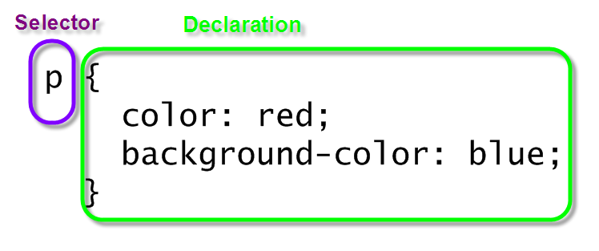

# Class 2 Reading 

## **HTML TEXT**

## Structure MarkUp

HTML elements are used to describe the structure of the page (e.g. headings, subheadings, paragraphs).

#### **Headings**

- HTML has six levels of headings
- h1 is the biggest and h6 the smallest
- Browsers display the contents of headings at different sizes

#### **Paragraphs**

- a paragraph consists of one or more sentences
- By default, a browser will show
each paragraph on a new line
with some space between it and
any subsequent paragraphs

- Browsers display the contents of headings at different sizes

- By enclosing words in the tags
`<b> and </b>` we can make
characters appear bold.
- By enclosing words in the tags
`<i> and </i>` we can make
characters appear italic.
- When the browser comes across
two or more spaces next to each
other, it only displays one space.
Similarly if it comes across a line
break, it treats that as a single
space too. This is known as
white space collapsing.
- if you wanted
to add a line break inside the
middle of a paragraph you can
use the line break tag ` `.
-To create a break between
themes — such as a change of
topic in a book or a new scene
in a play — you can add a
horizontal rule between sections
using the `
 `tag.

#### **Visual Editors & Their Code views**

- Content management systems and HTML editors such as Dreamweaver
usually have two views of the page you are creating: a visual editor and a
code view.

## Semantic Markup

HTML elements provide semantic information (e.g. where
emphasis should be placed, the definition of any
acronyms used, when given text is a quotation).

## **Introducing CSS**

- CSS treats each HTML element as if it appears inside
its own box and uses rules to indicate how that
element should look.

- Rules are made up of selectors (that specify the
elements the rule applies to) and declarations (that
indicate what these elements should look like).

- Different types of selectors allow you to target your
rules at different elements.

- Declarations are made up of two parts: the properties
of the element that you want to change, and the values
of those properties. For example, the font-family
property sets the choice of font, and the value arial
specifies Arial as the preferred typeface.

- CSS rules usually appear in a separate document,
although they may appear within an HTML page.

## **Javascript**

We use JS language to give a web browser instructions you want it to follow.

- A script is made up of a series of statements. Each
statement is like a step in a recipe.
- Scripts contain very precise instructions. For example, you might specify that a value must be remembered before creating a 
calculation using that value.

- Variables are used to temporarily store pieces of
information used in the script.

- Arrays are special types of variables that store more
than one piece of related information.
JavaScript distinguishes between numbers (0-9),
strings (text), and Boolean values (true or false).

- Expressions evaluate into a single value.
Expressions rely on operators to calculate a value.

### **Decisions and Loops**

- Conditional statements allow your code to make
decisions about what to do next.

- Comparison operators `(===, ! ==, ==, ! =, <, >, <=, =>)`
are used to compare two operands.

- Logical operators allow you to combine more than one
set of comparison operators.

- if ... else statements allow you to run one set of code
if a condition is true, and another if it is false.

- switch statements allow you to compare a value
against possible outcomes (and also provides a default
option if none match).

- Data types can be coerced from one type to another.

- All values evaluate to either truthy or falsy.

- There are three types of loop: for, while, and
do ... while. Each repeats a set of statements.